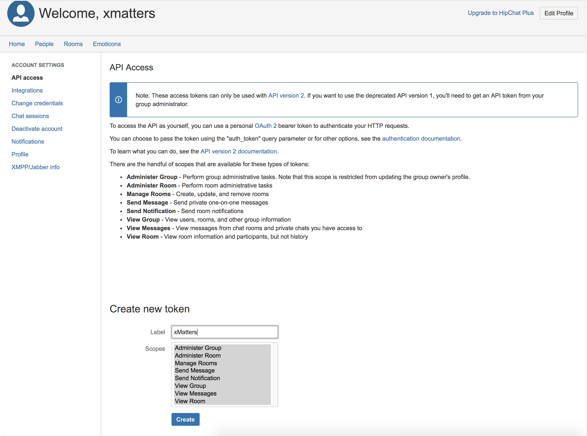

# HipChat Helper
Various helper functions for working with HipChat from xMatters. 

<kbd>
  
</kbd>

# Pre-Requisites
* HipChat account
* Existing communication plan - Use a packaged integration from the [integrations](https://xmatters.com/integrations) page, or [build your own](https://support.xmatters.com/hc/en-us/articles/202396229)
* xMatters account - If you don't have one, [get one](https://www.xmatters.com)!

# Files
* [HipChat.js](HipChat.js) - This is the code for the Shared Library that abstracts the interactions with HipChat to a higher level.

# Installation
Details of the installation go here. 

## HipChat set up
1. Login to HipChat and navigate to the `Account Settings` page. Click on `API access`. 
2. In the Create new token section, select all the scopes and give it a label, such as `xMatters`. 

<kbd>
  
</kbd>

(Note, this will tie the token to your user account, if that is undesirable, create a new user, login as that user and then generate the token as below.)

3. Copy the token value for later. 

## xMatters set up

1. Log in to your xMatters instance as a user with the Developer role (or anyone with access to the target communication plan). On the Developer tab, click Edit > Integration Builder for the target communication plan. 
2. Click `Edit Endpoints`, and then click `Add Endpoint` to add an endpoint for HipChat; fill out the following details:

   | Item | Selection |
   | ---- | --------- |
   | Name | HipChat |
   | Base URL | Base URL for your HipChat instance |
   | Authorization Type | None |   

3. Click `Edit Constants`, and then click `Add Constant`. fill out the following details:

   | Item | Selection |
   | ---- | --------- |
   | Name | HipChat Token |
   | Description | Token for authenticating into HipChat |
   | Value | Token Value from above | 
4. Click Save.

### Updating Scripts
**From here the next steps will depend on how xMatters will integrate to HipChat**

To create a new HipChat room:
```javascript
	 ////////////  createRoom ////////////////
     HipChat.setInstance( 'HipChat', constants['HipChat Token'] );
     var payload = {
	 	"name": data.issue_key,
	 	"topic": 'xMatters Engage: ' + summary
	 };

	 var room = HipChat.createRoom( payload );
	 ////////////////////////////////////////////////
```

To get the room history:
```javascript
    /////////// getRoomHistory /////////////////////
    /// Assuming the room name is stored in the `issue_key` property:
    var chatData = HipChat.getRoomHistory( callback.eventProperties.issue_key );
    
    // Then, massage for display in Jira:
    var chatText = buildHipChatText( chatData );
    
    // Send to Jira...
     

	function buildHipChatText( data ) {
	
	
		if( !data.items )
			return "No HipChat Text Found.";
	
		items = data.items;
	
		var textArr = items.map( function( item ){
		    baddate = item.date;
		    baddate = baddate.slice( 0, baddate.indexOf( '.' )+1 ) + baddate.slice( baddate.indexOf( '.' )+4 );
			var date = formatDate( new Date( baddate ) );
	
			var str = '{color:gray}' + date + '{color} ';
			if( item.from.mention_name ) 
				str += '*' + item.from.mention_name + '*';
			else
				str += '*' + item.from + '*';
	
			str += ': ' + item.message;
	
			return str;
		});
	
	
		return textArr.join( "\n" );
	}
	
	function formatDate( date ) {
	    
	    
	    //console.log( "formatDate: " + date + '. Year: ' + date.getFullYear() );
		return date.getFullYear() + '-' + (date.getMonth()+1) + '-' + date.getDate() + ' ' + date.getHours() + ':' + date.getMinutes() + 'Z';
	}

     ////////////////////////////////////////////////
```


# Testing

# Troubleshooting
The Activity Stream will have output of all HTTP requests as well as any additional debugging. 
